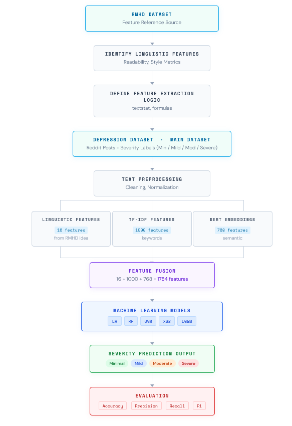
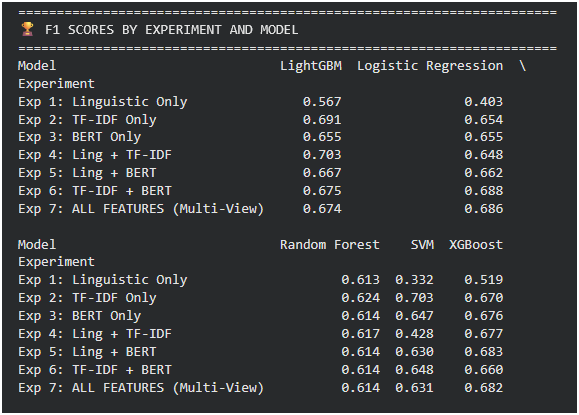
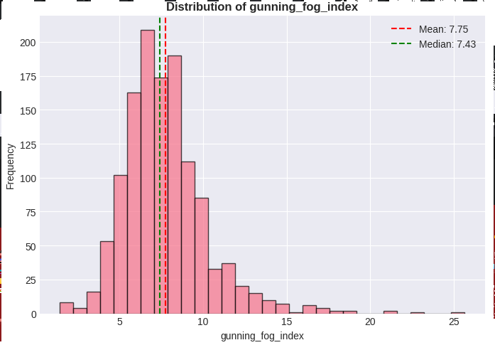
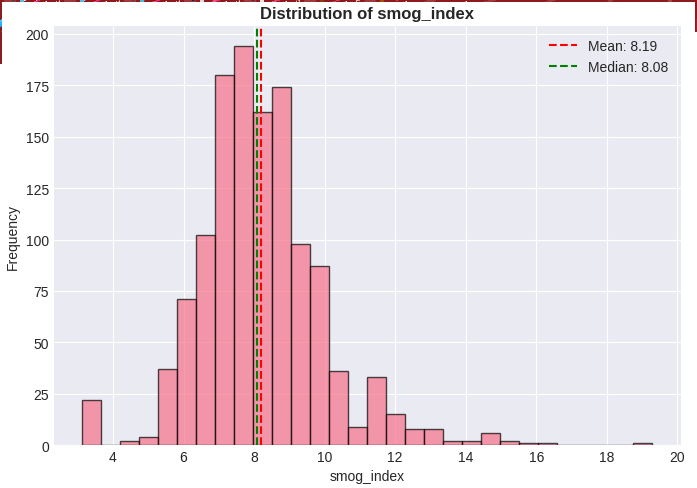

# multi-view-mental-health-severity-assessment
This project presents a multi-view machine learning framework for detecting and classifying mental health severity levels from Reddit posts using Natural Language Processing and Deep Learning techniques.

The framework combines:
- Psycholinguistic Features
- TF-IDF Features
- BERT Embeddings

to improve classification performance and semantic understanding of mental health-related text.


## Problem Statement
Mental health assessment through social media analysis is an important research area for early intervention and psychological support systems. Traditional approaches often fail to capture both linguistic and contextual semantic information effectively.

This project addresses this issue using a multi-view feature fusion framework.
## Dataset
- 3,549 labeled Reddit posts
- Four mental health severity classes:
  - Minimum
  - Mild
  - Moderate
  - Severe

Only a sample dataset is included in this repository.

---

## Feature Extraction

### 1. Psycholinguistic Features
Extracted readability and linguistic indicators including:
- Flesch Reading Ease
- SMOG Index
- Gunning Fog Index
- Pronoun Ratio
- Lexical Diversity
- Negative Word Ratio

### 2. TF-IDF Features
- 1000-dimensional sparse vectors
- Captures important textual patterns and term importance

### 3. BERT Embeddings
- 768-dimensional contextual embeddings
- Generated using `bert-base-uncased`

## Models Used
- Logistic Regression
- Random Forest
- Support Vector Machine (SVM)
- XGBoost
- LightGBM

## Best Performance
The LightGBM model with full feature fusion achieved:

- Weighted F1-score: **0.742**
- Improved semantic understanding and classification accuracy

---

## Project Structure

```bash
multi-view-mental-health-severity-assessment/
│
├── src/
│   ├── Mental_Health_Assessment.ipynb
│
├── results/
│   ├── architecture.png
│   ├── F1-score.png
│   ├── gunning_fog_distribution.png
│   ├── smog_distribution.png
│
├── README.md
├── LICENSE
└── .gitignore
```

---

## System Architecture



---

## Result Visualizations

### F1 Score Comparison


### Gunning Fog Distribution


### SMOG Distribution



## Technologies Used
- Python
- Scikit-learn
- PyTorch
- Hugging Face Transformers
- LightGBM
- XGBoost
- Pandas
- NumPy
- Matplotlib
- NLP


## Future Improvements
- Real-time mental health monitoring
- Streamlit/Web deployment
- Explainable AI integration
- Multi-modal mental health analysis
- LLM-based semantic reasoning


## Research Contributions
- Multi-view feature fusion framework
- Combined readability + semantic learning
- Context-aware NLP classification
- Comparative evaluation of ML models


## Author
Gaurav Kumar

